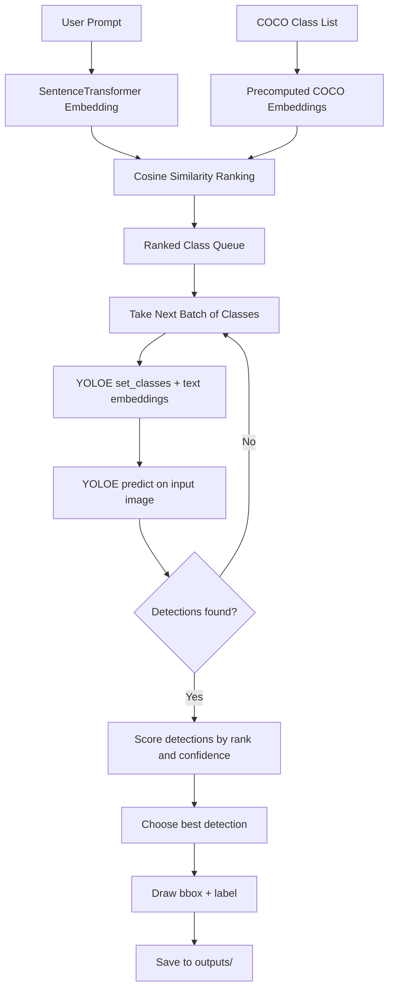

# YOLOE Prompt-Guided Detection

Prompt-driven object detection with semantic class ranking, batched re-parameterization, and early-exit inference.

## What This Project Does

- Uses SentenceTransformers to rank COCO classes by similarity to a natural-language prompt.
- Sends top-ranked classes to YOLOE in batches.
- Runs inference after each batch.
- Stops early as soon as a valid detection appears.
- Draws and saves annotated results to the `outputs/` folder.

## YOLOE Flow Diagram



## Repository Structure

- `Model/pipeline.py`: edge pipeline — YOLO26n detect + Model2Vec prompt rerank.
- `Model/environment.yml`, `Model/requirements.txt`: Python environment.
- `YOLOE/YOLOEmain.py`: prompt-guided YOLOE flow (batched re-parameterization, early exit).
- `YOLOE/YOLOEmaintestbench.py`: benchmark-style run with timing and resource logs.
- `YOLOE/YOLOEmain.ipynb`: notebook version for interactive testing.
- `images/`: input images and `test_cases.json`.
- `out_validate/`: batch validation outputs.
- `run_all.sh`: runs `Model/pipeline.py` over every case in `images/test_cases.json`.
- `qrts/`: FPGA port of the accelerator for Cyclone IV / DE2-115 (see `qrts/README.md`).

## Build and Run

### 1. Python environment

Conda (matches `run_all.sh`, which expects an env named `sittingducks`):

```bash
conda env create -f Model/environment.yml
conda activate sittingducks
```

Or plain pip (Python 3.9+; CPU-only works, GPU used automatically if present):

```bash
python -m venv .venv && source .venv/bin/activate   # Windows: .venv\Scripts\activate
pip install -r Model/requirements.txt
```

For the YOLOE flow instead, use `YOLOE/requirements.txt` and follow `YOLOE/VENV_SETUP.md`.

### 2. Model weights

- `Model/yolo26n.pt` and `YOLOE/yoloe-26n-seg.pt` are bundled in-tree.
- `Model/potion-base-8M/` (Model2Vec encoder, ~30 MB) downloads on first run.
- Weights and exported assets (`*.pt`, `*.onnx`, `*.ts`) are gitignored — do not commit them.

### 3. Run the pipeline

Single image:

```bash
python Model/pipeline.py "a thing you sit on" images/your_image.jpg --out out.jpg
```

Args: `prompt` and `image` positional; `--out` (default `out.jpg`); `--conf` YOLO
confidence threshold (default `0.05`, lower = more candidates).

Whole test suite (writes `out_validate/out_<test_id>.jpg`):

```bash
bash run_all.sh
```

`run_all.sh` reads `images/test_cases.json` and invokes the pipeline through
`conda run -n sittingducks`, so the conda env above is required for this path.

Notebook validation: open `validate_testcases.ipynb`
(`validate_testcases.executed.ipynb` is a recorded run).

YOLOE variant:

```bash
python YOLOE/YOLOEmain.py            # main flow
python YOLOE/YOLOEmaintestbench.py   # with timing and resource logs
```

### 4. FPGA build (optional)

The hardware port lives in `qrts/` and builds with Quartus Prime Lite 25.1std
for an EP4CE115F29C7 (DE2-115). Full detail — state, caveats, pin warnings —
is in [qrts/README.md](qrts/README.md).

```bash
export PATH="/d/qrtus/quartus/bin64:$PATH"   # or set QUARTUS_BIN
cd qrts/quartus
bash build.sh          # map -> fit -> sta -> asm, into output_files/dvcon.sof
bash build.sh map      # Analysis & Synthesis only, much faster
bash build.sh report   # summaries from the last run
```

Program over JTAG:

```bash
quartus_pgm -m jtag -o "p;output_files/dvcon.sof"
```

RTL simulation (needs Vivado `xvlog`/`xelab`/`xsim` on PATH):

```bash
bash qrts/sim/run.sh
```

Note: the current bitstream configures but cannot run a frame — no Qsys SDRAM
system and no `eth_cmd_engine` yet. Read `qrts/README.md` before programming
hardware.

## Runtime Behavior

1. Prompt text is embedded once per query.
2. COCO classes are ranked by semantic similarity.
3. Classes are evaluated in batches (default 10).
4. Each batch triggers one YOLOE re-parameterization and one inference pass.
5. On first non-empty detection batch, the pipeline exits early.
6. Best detection is rendered and saved.

## Notes for Git

Model and large generated assets are excluded in `.gitignore` (for example: `*.pt`, `*.onnx`, `*.ts`).
FPGA build output is excluded too: Quartus `db/`, `incremental_db/`, `output_files/`,
simulation work libraries (`qrts/sim/w*/`, `qrts/xsim.dir/`), and tool logs and reports.
Source, `.qpf`/`.qsf`/`.sdc`, scripts and generated `.mem`/`.mif` tables stay tracked.

## Troubleshooting

- Missing model file: ensure `yoloe-26n-seg.pt` is present in `YOLOE/`.
- Missing image file: ensure test images are in `YOLOE/images/`.
- Text model runtime error (`PytorchStreamReader...`): clear bad cached `.ts` assets and rerun.
- `run_all.sh` fails at `conda run`: the env is not named `sittingducks` — recreate it from `Model/environment.yml` or edit `ENV` in `run_all.sh`.
- `quartus_sh not on PATH`: set `QUARTUS_BIN` to the directory holding `quartus_sh.exe`.
- `xvlog not on PATH`: add Vivado's bin directory (e.g. `/d/AMD/2025.2/Vivado/bin`).